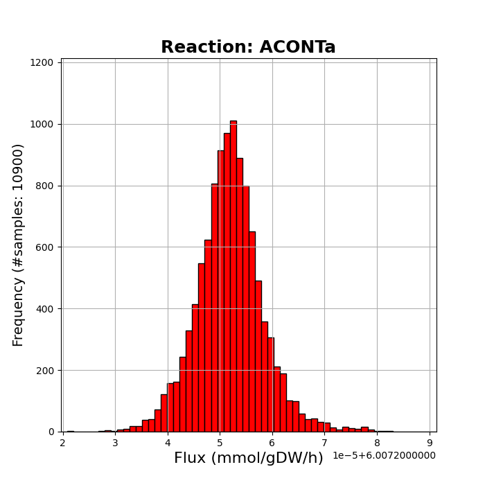
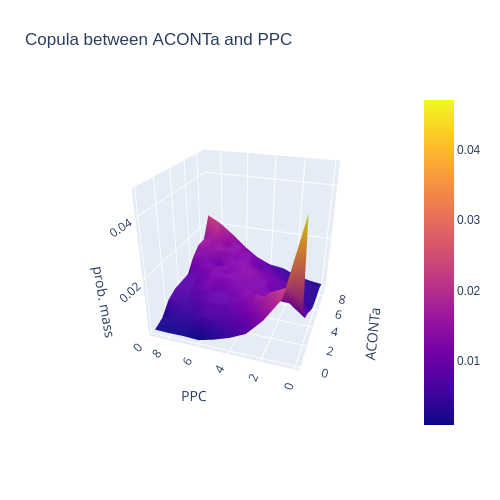

<p align="center"></p>

**dingo** is a Python package that analyzes metabolic networks.
It relies on high dimensional sampling with Markov Chain Monte Carlo (MCMC)
methods and fast optimization methods to analyze the possible states of a
metabolic network. To perform MCMC sampling, `dingo` relies on the `C++` library
[volesti](https://github.com/GeomScale/volume_approximation), which provides
several algorithms for sampling convex polytopes.
`dingo` also performs two standard methods to analyze the flux space of a
metabolic network, namely Flux Balance Analysis and Flux Variability Analysis.

`dingo` is part of [GeomScale](https://geomscale.github.io/) project.

[](https://github.com/GeomScale/dingo/actions?query=workflow%3Adingo-ubuntu)
[](https://colab.research.google.com/github/GeomScale/dingo/blob/develop/tutorials/dingo_tutorial.ipynb)
[](https://gitter.im/GeomScale/community?utm_source=share-link&utm_medium=link&utm_campaign=share-link)


## Installation

**Note:** Python version should be 3.8.x. You can check this by running the following command in your terminal:
```bash
python --version
```
If you have a different version of Python installed, you'll need to install it ([start here](https://linuxize.com/post/how-to-install-python-3-8-on-ubuntu-18-04/)) and update-alternatives ([start here](https://linuxhint.com/update_alternatives_ubuntu/))

**Note:** If you are using `GitHub Codespaces`. Start [here](https://docs.github.com/en/codespaces/setting-up-your-project-for-codespaces/adding-a-dev-container-configuration/setting-up-your-python-project-for-codespaces) to set the python version. Once your Python version is `3.8.x` you can start following the below instructions.


To load the submodules that dingo uses, run

````bash
git submodule update --init
````

You will need to download and unzip the Boost library:
```
wget -O boost_1_76_0.tar.bz2 https://boostorg.jfrog.io/artifactory/main/release/1.76.0/source/boost_1_76_0.tar.bz2
tar xjf boost_1_76_0.tar.bz2
rm boost_1_76_0.tar.bz2
```

You will also need to download and unzip the lpsolve library:
```
wget https://sourceforge.net/projects/lpsolve/files/lpsolve/5.5.2.11/lp_solve_5.5.2.11_source.tar.gz
tar xzvf lp_solve_5.5.2.11_source.tar.gz
rm lp_solve_5.5.2.11_source.tar.gz
```

Then, you need to install the dependencies for the PySPQR library; for Debian/Ubuntu Linux, run

```bash
sudo apt-get update -y
sudo apt-get install -y libsuitesparse-dev
```

To install the Python dependencies, `dingo` is using [Poetry](https://python-poetry.org/),
```
curl -sSL https://install.python-poetry.org | python3 - --version 1.3.2
poetry shell
poetry install
```

To exploit the fast implementations of dingo, you have to install the [Gurobi solver](https://www.gurobi.com/). Run

```
pip3 install -i https://pypi.gurobi.com gurobipy
```

Then, you will need a [license](https://www.gurobi.com/downloads/end-user-license-agreement-academic/). For more information, we refer to the Gurobi [download center](https://www.gurobi.com/downloads/).


## Unit tests

Now, you can run the unit tests by the following commands:
```
python3 tests/fba.py
python3 tests/full_dimensional.py
python3 tests/max_ball.py
python3 tests/scaling.py
python3 tests/rounding.py
python3 tests/sampling.py
```

If you have installed Gurobi successfully, then run
```
python3 tests/fast_implementation_test.py
```

## Tutorial

You can have a look at our [Google Colab notebook](https://colab.research.google.com/github/GeomScale/dingo/blob/develop/tutorials/dingo_tutorial.ipynb)
on how to use `dingo`.


## Documentation


It quite simple to use dingo in your code. In general, dingo provides two classes:

- `metabolic_network` represents a metabolic network
- `polytope_sampler` can be used to sample from the flux space of a metabolic network or from a general convex polytope.

 The following script shows how you could sample steady states of a metabolic network with dingo. To initialize a metabolic network object you have to provide the path to the `json` file as those in [BiGG](http://bigg.ucsd.edu/models) dataset or the `mat` file (using the `matlab` wrapper in folder `/ext_data` to modify a standard `mat` file of a model as those in BiGG dataset):

```python
from dingo import MetabolicNetwork, PolytopeSampler

model = MetabolicNetwork.from_json('path/to/model_file.json')
sampler = PolytopeSampler(model)
steady_states = sampler.generate_steady_states()
```

`dingo` can also load a model given in `.sbml` format using the following command,

```python
model = MetabolicNetwork.from_sbml('path/to/model_file.sbml')
```

The output variable `steady_states` is a `numpy` array that contains the steady states of the model column-wise. You could ask from the `sampler` for more statistical guarantees on sampling,

```python
steady_states = sampler.generate_steady_states(ess=2000, psrf = True)
```

The `ess` stands for the effective sample size (ESS) (default value is `1000`) and the `psrf` is a flag to request an upper bound equal to 1.1 for the value of the  *potential scale reduction factor* of each marginal flux (default option is `False`).

You could also ask for parallel MMCS algorithm,

```python
steady_states = sampler.generate_steady_states(ess=2000, psrf = True,
                                               parallel_mmcs = True, num_threads = 2)
```

The default option is to run the sequential [Multiphase Monte Carlo Sampling algorithm](https://arxiv.org/abs/2012.05503) (MMCS) algorithm.

**Tip**: After the first run of MMCS algorithm the polytope stored in object `sampler` is usually more rounded than the initial one. Thus, the function `generate_steady_states()` becomes more efficient from run to run.


#### Rounding the polytope

`dingo` provides three methods to round a polytope: (i) Bring the polytope to John position by apllying to it the transformation that maps the largest inscribed ellipsoid of the polytope to the unit ball, (ii) Bring the polytope to near-isotropic position by using uniform sampling with Billiard Walk, (iii) Apply to the polytope the transformation that maps the smallest enclosing ellipsoid of a uniform sample from the interior of the polytope to the unit ball.

```python
from dingo import MetabolicNetwork, PolytopeSampler

model = MetabolicNetwork.from_json('path/to/model_file.json')
sampler = PolytopeSampler(model)
A, b, N, N_shift = sampler.get_polytope()

A_rounded, b_rounded, Tr, Tr_shift = sampler.round_polytope(A, b, method="john_position")
A_rounded, b_rounded, Tr, Tr_shift = sampler.round_polytope(A, b, method="isotropic_position")
A_rounded, b_rounded, Tr, Tr_shift = sampler.round_polytope(A, b, method="min_ellipsoid")
```

Then, to sample from the rounded polytope, the user has to call the following static method of PolytopeSampler class,

```python
samples = sample_from_polytope(A_rounded, b_rounded)
```

Last you can map the samples back to steady states,

```python
from dingo import map_samples_to_steady_states

steady_states = map_samples_to_steady_states(samples, N, N_shift, Tr, Tr_shift)
```

#### Other MCMC sampling methods

To use any other MCMC sampling method that `dingo` provides you can use the following piece of code:

```python
sampler = polytope_sampler(model)
steady_states = sampler.generate_steady_states_no_multiphase() #default parameters (method = 'billiard_walk', n=1000, burn_in=0, thinning=1)
```

The MCMC methods that dingo (through `volesti` library) provides are the following: (i) 'cdhr': Coordinate Directions Hit-and-Run, (ii) 'rdhr': Random Directions Hit-and-Run,
(iii) 'billiard_walk', (iv) 'ball_walk', (v) 'dikin_walk', (vi) 'john_walk', (vii) 'vaidya_walk'.


#### Fast and slow mode

If you have installed successfully the `gurobi` library, dingo turns to the *fast mode* by default. To set a certain mode you could use the following member functions,

```python
sampler = polytope_sampler(model)

#set fast mode to use gurobi library
sampler.set_fast_mode()
#set slow mode to use scipy functions
sampler.set_slow_mode()
```


### Apply FBA and FVA methods

To apply FVA and FBA methods you have to use the class `metabolic_network`,

```python
from dingo import MetabolicNetwork

model = MetabolicNetwork.from_json('path/to/model_file.json')
fva_output = model.fva()

min_fluxes = fva_output[0]
max_fluxes = fva_output[1]
max_biomass_flux_vector = fva_output[2]
max_biomass_objective = fva_output[3]
```

The output of FVA method is tuple that contains `numpy` arrays. The vectors `min_fluxes` and `max_fluxes` contains the minimum and the maximum values of each flux. The vector `max_biomass_flux_vector` is the optimal flux vector according to the biomass objective function and `max_biomass_objective` is the value of that optimal solution.

To apply FBA method,

```python
fba_output = model.fba()

max_biomass_flux_vector = fba_output[0]
max_biomass_objective = fba_output[1]
```

while the output vectors are the same with the previous example.


### Set the restriction in the flux space

FVA and FBA,  restrict the flux space to the set of flux vectors that have an objective value equal to the optimal value of the function. dingo allows for a more  relaxed option where you could ask for flux vectors that have an objective value equal to at least a percentage of the optimal value,

```python
model.set_opt_percentage(90)
fva_output = model.fva()

# the same restriction in the flux space holds for the sampler
sampler = polytope_sampler(model)
steady_states = sampler.generate_steady_states()
```

The default percentage is `100%`.


### Change the objective function

You could also set an alternative objective function. For example, to maximize the 1st reaction of the model,

```python
n = model.num_of_reactions()
obj_fun = np.zeros(n)
obj_fun[0] = 1
model.biomass_function(obj_fun)

# apply FVA using the new objective function
fva_output = model.fva()
# sample from the flux space by restricting
# the fluxes according to the new objective function
sampler = polytope_sampler(model)
steady_states = sampler.generate_steady_states()
```


### Plot flux marginals

The generated steady states can be used to estimate the marginal density function of each flux. You can plot the histogram using the samples,

```python
from dingo import plot_histogram

model = MetabolicNetwork.from_json('path/to/e_coli_core.json')
sampler = PolytopeSampler(model)
steady_states = sampler.generate_steady_states(ess = 3000)

# plot the histogram for the 14th reaction in e-coli (ACONTa)
reactions = model.reactions
plot_histogram(
        steady_states[13],
        reactions[13],
        n_bins = 60,
        )
```

The default number of bins is 60. dingo uses the package `matplotlib` for plotting.



### Plot a copula between two fluxes

The generated steady states can be used to estimate and plot the copula between two fluxes. You can plot the copula using the samples,

```python
from dingo import plot_copula

model = MetabolicNetwork.from_json('path/to/e_coli_core.json')
sampler = PolytopeSampler(model)
steady_states = sampler.generate_steady_states(ess = 3000)

# plot the copula between the 13th (PPC) and the 14th (ACONTa) reaction in e-coli
reactions = model.reactions

data_flux2=[steady_states[12],reactions[12]]
data_flux1=[steady_states[13],reactions[13]]

plot_copula(data_flux1, data_flux2, n=10)
```

The default number of cells is 5x5=25. dingo uses the package `plotly` for plotting.




