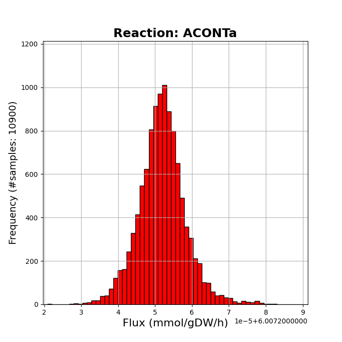

## Run dingo from terminal

You can read analytical instructions of how to use dingo from terminal by typing,

```
python -m dingo -h
```

In the sequel, we present the main options for a user.  

You can call dingo by providing the path to the `json` file (as those in [BiGG](http://bigg.ucsd.edu/models) dataset) of a model:

```
python -m dingo -i model.json
```
Otherwise, you can use the `matlab` script in `./ext_data` folder to transform a `.mat` file (also as those in BiGG dataset) into a `.mat` file that dingo can read,

```
python -m dingo -i dingo_model.mat
```

By default, dingo generates uniformly distributed steady states of the given metabolic network. In particular, it computes the full dimensional polytope implied by  and then samples from it using the [Multiphase Monte Carlo Sampling algorithm](https://arxiv.org/abs/2012.05503) (MMCS) with the target distribution being the uniform distribution. Finally, dingo saves to the current path --using `pickle` package--,  

(a) a `pickle` file`dingo_metabolites_reactions_model` that contains two lists with the names of the metabolites and the reactions of the model,  

(b) a `pickle` file `dingo_minmax_fluxes_model` that contains two vectors with the minimum and maximum flux values,  

(b) a `pickle` file `dingo_steady_states_model` with the generated steady states of the model,  

(c) a `pickle` file `dingo_rounded_polytope_model` that contains the matrices of the full dimensional polytope and the matrices of the linear transformations that map the polytope to the initial space.  

Instead of `_model` the output files have the name of the input model. However, you could specify the name by,

```
python -m dingo -i model.json -name model_name
```

You could also specify the output directory,  

```
python -m dingo -i model.json -o output_directory
```

Since for high dimensional networks the complete pipeline of dingo is time consuming, you could split it into separate steps.
You can ask dingo to complete only the preprocessing of a model; that is computing only the full dimensional polytope,

```
python -m dingo -i model.json -o output_directory -preprocess True
```

This command saves,  

(a) a `pickle` file`dingo_metabolites_reactions_model` similar to the above file,  

(b) a `pickle` file `dingo_minmax_fluxes_model` similar to the above,  

(c) a `pickle` file `dingo_polytope_model` similar to the above, however the full dimensional polytope is not necessarily rounded.  

Finally, you can use the output polytope to sample from it,

```
python -m dingo -poly dingo_rounded_polytope_model
```

Moreover, the sampling from a rounded polytope is more efficient. You should use that polytope to sample additional steady states.


### Statistical guarantees

dingo provides two statistical guarantees for the quality of the generated sample based on two MCMC diagnostics, (a) the *effective sample size* (ESS)  and (b) the *potential scale reduction factor* (PSRF).  

dingo sets by default the target effective sample size (ESS) for each flux marginal equal to 1000. You could ask for a different value of ESS,

```
python -m dingo -i model.json -n 2000
```

You can also ask for an additional statistical guarantee by setting an upper bound equal to 1.1 on the values of the PSRF of each flux marginal,

```
python -m dingo -i model.json -psrf True
```

Then, dingo samples until it achieves the target values of ESS and PSRF for each flux marginal.  


### Fast and robust computations with gurobi library

The default Linear Program (LP) solver that dingo uses is the `linprog` from package `scipy`. However, this solver might fail to perform the required computations, or would be too slow. dingo also uses the LP solver of [`gurobi`](https://www.gurobi.com/downloads/?campaignid=2027425882&adgroupid=77414946611&creative=406173548636&keyword=gurobi&matchtype=e&gclid=CjwKCAjwpKCDBhBPEiwAFgBzj6dqIVtvMCfl2VQEDb3t4azHbvHN5vKoqcKNtAgHC9iBTlt3kqK2aBoC7CYQAvD_BwE) library which much faster and accurate than `linprog`. You could ask for `gurobi` by the following flag,

```
python -m dingo -i model.json -s gurobi
```

The default choice is `linprog` since `gurobi` needs a license to work.


### Handling the objective function  

Given the metabolic network, dingo --by default-- restricts the flux space to the set of flux vectors that have an objective value equal to the optimal value of the function. dingo allows for a more  relaxed option where you could ask to sample flux vectors that have an objective value equal to at least a percentage of the optimal value,

```unix
python -m dingo -i model -opt 90
```

which ask for flux vectors with a value equal to the 90% of the optimal value.  


Moreover, you can ask dingo to ignore the objective function,

```
python -m dingo -i model -unbiased True
```

In this case dingo does not impose any additional restriction to the flux space.


### Alternative distributions

dingo can sample from the flux space according to two more alternative distributions compare to the uniform distribution (i.e. the spherical Gaussian distribution and the exponential distribution). To ask for an alternative target distribution use the flag `-d`,

```
python -m dingo -i model -d exponential
```

or,

```
python -m dingo -i model -d gaussian
```

When the choice is the exponential distribution, dingo ignores the objective function and does not impose a certain objective value to the flux vectors. When the choice is the gaussian distribution, dingo sets the mode to be the center of the maximum inscribed ball of the full dimensional polytope.  


### Parallel computations

dingo provides also a parallel implementation of MMCS algorithm. This implementation leads to faster computations. To sample steady state with parallel MMCS,

```
python -m dingo -i model.json -pmmcs True --num_threads 2
```

The flag `--num_threads` requests the number of threads to be used and it can be replaced with flag `-nt` for simplicity.


### Plotting flux marginal histograms

dingo exploits the library `matplotlib` to provide a default histogram plot for a given flux marginal. To generate the histogram you wish you have to give (a) the path to a pickle file tha was generated by dingo and contains the names of the metabolites and the reactions of a model, (b) the path to a pickle file that was generated by dingo and contains steady states of a model and optionally the number of bins (the default value is 40) and the reaction index (the default index is 1),

```
python3 -m dingo -hist True -st dingo_steady_states_model -mr dingo_metabolites_reactions_model -reaction_id flux_index
```

For example the following plot corresponds to the reaction `Acetate_kinase`of the `e_coli_core` model.



### FVA method

To call FVA method run the following command,

```
python -m dingo -i model.json -fva True -opt opt_percentage
```

while the `-opt` flag is optional with the default percentage equal to `100%`. This command saves a `pickle` file `dingo_fva_model` that contains the vectors of min and max fluxes of the reactions, the biomass objective function optimal flux vector/solution and the biomass objective function optimal value.


### FBA method

To call FBA method run the following command,

```
python -m dingo -i model.json -fba True
```

This command saves the biomass objective function optimal flux vector/solution and the biomass objective function optimal value.